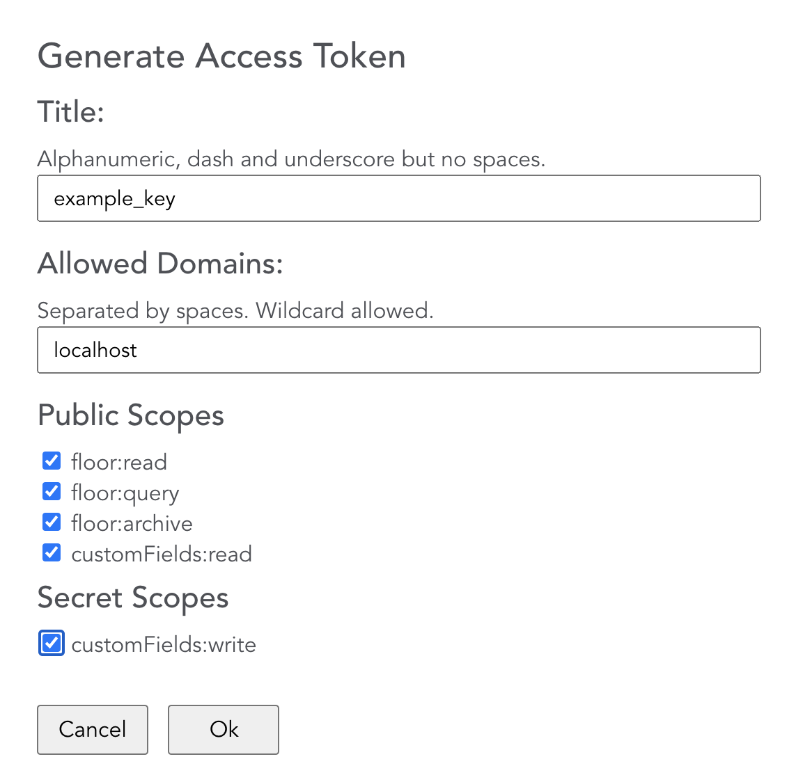

# Archilogic Seat Assignment App Example

This is a simple prototype of a seat assignment app for managing seat assignment in a given space.

Check out a [Demo](https://archilogic-seat-assignment.herokuapp.com)

## Setup local server 

Navigate to the server folder and run:

    yarn install

The server needs a secret token to negotiate a temporary token.

https://developers.archilogic.com/space-api/v2/introduction.html#secret-access-token

Create a new secret token and add it to the ARCHILOGIC_SECRET_KEY environment variable. Additionally, set the ARCHILOGIC_API_URL variable

```bash
export ARCHILOGIC_SECRET_KEY=<secret-key-goes-here>
export ARCHILOGIC_API_URL=https://api.archilogic.com
```


then run:

    node server.js

## Install and Run

In the project directory, you can run:

	npm install

This command will install all the dependencies needed for the project to run locally.

To run the app we'll need to set some environment variables first.  
You'll need an [API key](https://developers.archilogic.com/space-api/v2/introduction.html#authentication-and-authorization).  




Once you have these keys, please create a .env file  (you can copy it from .env.example) and fill in the values for 

	cp .env.example .env
	 	
Update .env variables:

	REACT_APP_PUBLISHABLE_TOKEN=YOUR_TOKEN
	REACT_APP_ARCHILOGIC_API_URL=https://api.archilogic.com

To run the application execute:

	npm start

The project loads a default scene but you can change it by a different one by specifing `?sceneId=THIS_IS_ANOTHER_SCENE_ID` in the browser url.  

```html
http://localhost:3001/?sceneId=0246512e-973c-4e52-a1f2-5f0008e9ee9c
```

## The App

We need the ability to assign a desk to a user so that we can see which desks are free and which are taken.

### Highlighting available desks in a floor

in `components/FloorPlan.tsx`

```javascript
const highlightDesks = (spaces: Array<any>, furniture: Array<any>, floorPlan: any) => {
    const desks: any[] = []
    spaces.forEach((space: any) => {
        if (space.usage === "Work") {
            space.furniture.forEach((furnitureItemId: string) => {
                const furnitureItem = findById(furniture, furnitureItemId)
                // to identify a desk we look into the furniture item's productData.tags value
                if (furnitureItem && isDesk(furnitureItem)) {
                    highlightDesk(furnitureItem, floorPlan)
                }
            })
        }
    })
}
```

### Highlight available desks

in `components/FloorPlan.tsx`

```javascript
const highlightDesk = (furnitureItem: any) => {
    furnitureItem.node.setHighlight({fill: colors.assignable})
}
```

### Assigning a desk (drag and drop)

in `components/FloorPlan.tsx`

```javascript
const onDrop = (archilogicEvent: any, floorPlan: any) => {
        const event = archilogicEvent.sourceEvent;

        event.preventDefault();

        const position = [event.offsetX, event.offsetY];
        const { assets } = floorPlan.getResourcesFromPosition(floorPlan.getPlanPosition(position));
        
        if (assets.length === 0 || !isDesk(assets[0])) return;
        const furnitureItem = assets[0];

        const userId = event?.dataTransfer?.getData('text')
  
        if (!userId) return;        
        
        const user = UserService.findById(parseInt(userId))

        if (!furnitureItem || !user) return

        addDeskAssignment({
            userId: parseInt(userId), 
            deskId: furnitureItem.id
        })

        highlightAssignedDesk(furnitureItem)
    }

const highlightAssignedDesk = (furnitureItem: any, user: IUser) => {
    furnitureItem.node.setHighlight({fill: colors.assigned})
}
```

### Displaying an asset's assigned user with [Info Window](https://developers.archilogic.com/floor-plan-engine/guide.html#info-window)

in `components/FloorPlan.tsx`

```javascript
const onDeskClick = (event: any, floorPlan: any) => {
    const { assets } = floorPlan.getResourcesFromPosition(event.pos);
    if (assets.length === 0 || !isDesk(assets[0])) return;
    const furnitureItem = assets[0];

    setClickedDesk(furnitureItem);
}

useEffect(() => {
    if (!clickedDesk || !floorPlan) return

    const assignment = _.find(deskAssignments, (item) => {
        return String(item.deskId) === String(clickedDesk.id)
    });

    if(!assignment) return;
    const user = UserService.findById(assignment.userId)

    clickedDesk.infoWindow = floorPlan.addInfoWindow({
        pos: [clickedDesk.position.x, clickedDesk.position.z],
        width: 150,
        height: 80,
        html: '<div>' +
                '<div class="user-photo"></div>' +
                '<div class="user-name">'+user.firstName+' '+user.lastName+'</div>' +
            '</div>',
        closeButton: true
    })

    return () => { clickedDesk.infoWindow.remove(); }
    // eslint-disable-next-line react-hooks/exhaustive-deps
}, [clickedDesk, deskAssignments, floorPlan])
```

### Saving the user id in an asset's custom field via the Space API

in `shared/services/AssetService.tsx`

```javascript
export const assignedToPath = 'properties.customFields.assignedTo'
const resourceType = 'asset'

const assignUser = (deskAssignment: IDeskAssignment) => {
    return axios.put(`${PROXY_URL}/v2/${resourceType}/${deskAssignment.deskId}/custom-field/${assignedToPath}`, {userId: deskAssignment.userId})
}
```


### Archilogic library setup

Index file `public\index.html`:

```html
<!DOCTYPE html>
<html lang="en">

<head>
    <meta charset="utf-8" />
    <link rel="icon" href="%PUBLIC_URL%/favicon.ico" />
    <meta name="viewport" content="width=device-width, initial-scale=1" />
    <meta name="theme-color" content="#000000" />
    <meta name="description" content="Seat Assignment using Archilogic Floor Plan Engine" />
    <link rel="apple-touch-icon" href="%PUBLIC_URL%/logo192.png" />

    <script src="https://code.archilogic.com/fpe-preview/v2.2.x/fpe.js?key=%REACT_APP_ARCHILOGIC_PUBLISHABLE_API_KEY%"></script>

```


### Floorplan Initialization

In file `src\components\Floorplan\FloorPlan.tsx` when the sceneId value is available trough props, we initialize the floor-plan and attach it to the DOM element `#floorplan`

```javascript
useEffect(() => {
    const container = document.getElementById('floorplan')
    const fp = new FloorPlanEngine(container, floorPlanStartupSettings)
    fp.loadScene(props.sceneId).then(() => {
        props.setSpaces(fp.state.computed.spaces)
        onSpacesLoaded(fp.state.computed.spaces)
    })
}, [props.sceneId]);
```


### Other Libraries Used In This Project

[Axios](https://github.com/axios/axios) - Promise based HTTP client for the browser and node.js.  
[Ant Design](https://ant.design/) - A UI Design language and React UI library.  
[Typescript](https://www.typescriptlang.org/) - Optional static type-checking along with the latest ECMAScript features.  
[lodash](https://lodash.com/) - A JavaScript utility library delivering consistency, modularity, performance, & extras.  
[Redux](https://redux.js.org/) - A Predictable State Container for JS Apps.
[Moment.js](https://momentjs.com/) - Parse, validate, manipulate, and display dates and times in JavaScript.  
[uuidjs](https://github.com/uuidjs/uuid#readme) - 
Generate RFC-compliant UUIDs in JavaScript.  


## Notes

`Why do we need to have a proxy app to hit Archilogic's Space API?`  
This is a [Secret API](https://developers.archilogic.com/space-api/v2/introduction.html) key and we don't want to expose it in the client app.

`How does the HTML drag and drop API work?`  
Very nice article [here](https://alligator.io/js/drag-and-drop-vanilla-js/) from Jess Mitchell
